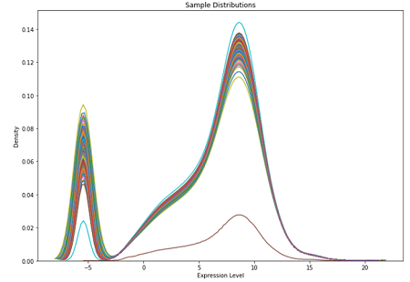

# Classification Algorithm for Labeled Matrices
A multilayer perceptron (MLP) neural network used to classify labels using biological features such as gene expression or genotypes. 

This project aims to create a 'general purpose classifier' that will label continous or discrete data using supervised learning. The project will take two files, a sample file and label file, and hyperparamteters specified by the user as command-line arguments. Some of these hyperparamters include, batch size, learning rate, test split, continuous or discrete data, etc. Because no dataset is exactly the same, more command-line options will likely need to be added, such as number of hidden layers/neurons, to fully optimize this general purpose classifer.

Currently, this project only supports continuous data which is being classified into 3 or more labels.

# TODO:
## Explain how labels are collected, missing samples are taken care, the assumptions that the data is normalized, and explain the images at the bottom. Maybe resize the accuracy graph aswell.

Don't call this section this
## Considerations before beginning
This project assumes

## Requirements
- torch
- pandas
- matplotlib
- scikit-learn
- seaborn

## Palmetto Setup
Because this project is meant to be run on the Palmetto Cluster, an Anaconda Environment will need to be set up with the required dependencies installed.

### Installation
Naviagte to the desired scratch directory and clone the repository as shown belown. On the palmetto cluster, the git module will probably need to be added first.

```bash
module add git/2.27.0-gcc/8.3.1

git clone https://github.com/bradford415/CALM.git
```

### Anaconda Environment
Create a virtual environment with the required dependecies. If a virtual envrionment already exists and meets these requirements, this step can be skipped.
```bash
module add anaconda3/5.10-gcc/8.3.1

conda create -n myenv python=3.7 pytorch pandas matplotlib scikit-learn seaborn
```
If you wish to use an existing environment, use the pip command to install each missing dependency inside your environment. Example:
```bash
source activate myenv

pip install seaborn pytorch pandas matplotlib scikit-learn
```

### PBS Script
The pbs file contains the necessary script to run CALM on the palmetto. The node resources, virtual environment, and command-line arguments are set in this script.

First, Open the classifier.pbs script and verify the resources of the node are correct. Show below are the default resources. 
```
select=1:ncpus=4:mem=32gb:interconnect=fdr,walltime=2:00:00
```
To use a gpu, replace the line above with the line below. For some reason the only gpu that will work with PyTorch is the p100 model. When requesting a gpu, the mem must be 16gb or greater. At least this was the case when testing the lung dataset.
```
select=1:ncpus=4:mem=16gb:ngpus=1:gpu_model=p100:interconnect=fdr,walltime=2:00:00
```

Next, change the virtual environment being used. The default environement is 'myenv'. Change the line below to use the virtual env you created or modified.
```
source activate myenv
```
The rest of the pbs file calls the main python script, along with specifying the command line arguments. The most important command line arguments are '--sample_file', '--label_file', and '--output_name', these MUST be changed. The command line arguments are shown below, followed by a description of each.
```
python src/main.py --sample_file lung.emx.txt \
                   --label_file sample_condiiton.txt \
                   --output_name tissue-run-1 \ 
                   --max_epoch 75 \
                   --batch_size 16 \
                   --learning_rate 0.001 \
                   --test_split 0.3 \
                   --continuous_discrete continuous \
                   --plot_results True \
                   --use_gpu False
```
- sample_file 
  - The name of the matrix file that contains the samples (columns) and genes (rows). Currently, only continuous expression values are supported such as a GEM. This file will be added to the input directory at a later step.
- label_file
  - The name of the label file. This file maps the sample, columns of the sample_file, to its label. This label is what the classifier attempts to predict. The label file will also be added to the input directory at a later step. 
- output_name
  - The name of the output directory that will be created to store all of the output files such as the density plot, accuracy graphs, confusion matrix and label classifcaiton results. This output directory will have the current time-stamp appended to it to prevent future runs from overwriting this directory.
- max_epoch
  - The number of iterations to train the model for
- batch_size
  - The number of samples that is propagated into the model at one time until the end of the dataset is reached.The weights of the model update after each batch. 
- learning_rate
  - Controls the rate at which the weights of the model update
- test_split
  - The percetage to split the full dataset into test data. A value of 0.3 would split the dataset up into 70% train and 30% test.  
- continous_discrete
  - The type of data in the sample file, this arugment only takes the values continous or discrete. Continous data represents an infinite amount of values (usually floats that are bounded or unbounded) and is plotted as a smooth line, an example of continous data is RNA expression values like a raw GEM. Discrete data represents a finite range of values and are typically integers, an example of this would be a DNA matrix which the data is only a value of 0, 1, 2, or 3. Currently, this project only supports continuous data.
- plot_results
  - A True or False argument that determines if visuals are created and should probably always be True. This will plot the distribution of the data, training/validation accuracy/loss, and the confusion matrix which shows how well the test data was classified. 
- use_gpu
  - A True or False argument that determines whether to use a GPU or not. The project is only set up to use 1 GPU and for some reason with PyTorch only the p100 GPU model will work. 

### Input Files
There are two plaintext input files that are required, the sample file and the label file.

The sample file is a labeled matrix which has the features as rows and the sample as columns. The features can essentially be anything that describe the label. Two common features are genes with their expression levels (continuous), and genotypes corresponding to a number system (discrete). 

The label file contains two columns, seperated by a space or tab with no header. The first column lists the sample names, the second column maps the sample to a sepecific label. 

Below shows an example of what the sample file and label file should look like. This example is GEM that can be categorized into 3 categories/labels: Cancerous, Normal, Indeterminate. Each cell is seperated by a space or tab, the table was just used for formatting purposes. The number of samples in both files must match or else an error will be thrown.

#### Sample File                                                  
```       
         sample1     sample2    sample3              
gene1    5.359       19.359     0.239       
gene2    12.369      1.556      8.934       
gene3    11.265      3.625      2.051      
gene4    7.562       5.359      5.359      
```
#### Label File
```                       
sample1    cancerous      
sample2    indeterminate  
sample3    indeterminate  
sample4    normal         
```

 Move both of these files into the input directory. Example commands to move input files into the input directory
```bash
# Start from inside the main project directory then move into the input directory
cd input

# Copy sample and label into this directory. My files are stored in my palmetto home directory inside a dataset directory.
# The '~' specifies home directory and the '.' means the current directory
# So we are copying the label and sample file from the home/dataset directory to the current directory we are in
cp ~/dataset/sample_file.emx.txt .
cp ~/dataset/label_file.txt .
```
## Running
To run the project, navigate to the root directory of the project and schedule the job with the following command.
```
qsub classifier.pbs
```

To check the job status at any point, use this command
```
qstat -u <user_name>
```

## Output
When the job finishes, a new directory is created in the output based on the '--output_name' command-line argument. This directory contains the log file, density plot, accuracy graphs, and confusion matrix.

The log file tracks several things:
- The date and time of running the project
- The hyperparamters used for the network
- The percentage of the dataset that was used for training and testing
- Classification labels
- Training log which reports the classification accuracy and loss per epoch

The density plot shows the distribution of the samples after the missing values have been replaced.

The accuracy graphs show a visual of how well the model classified the samples per epoch.

The confusion matrix shows how each sample in test dataset was classified after the model is trained.

Below shows classification resultsfrom a run that used a gene expression matrix from lung tissue as the sample file. 70% of the samples was used to train the model and 30% was used to test the model.

#### Density Plot


#### Accuracy Graph


#### Confusion Matrix


